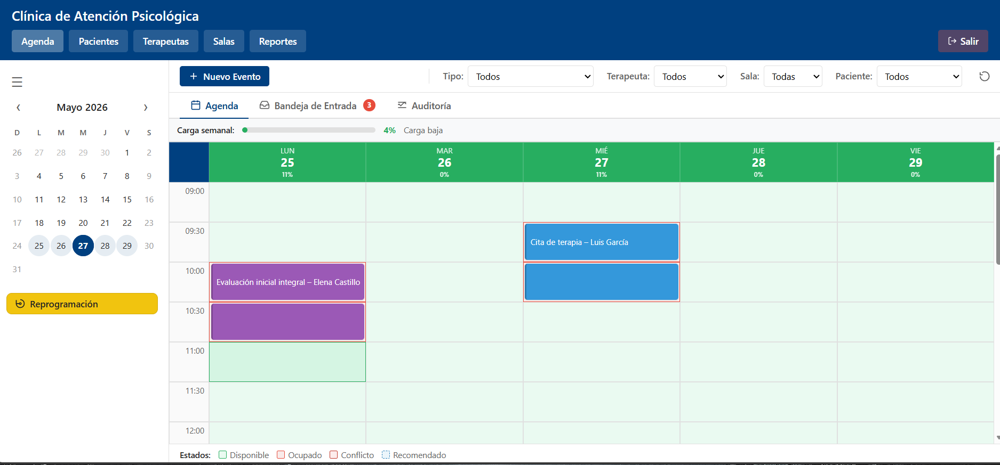
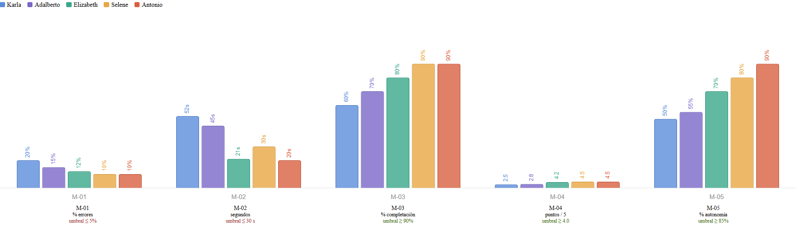
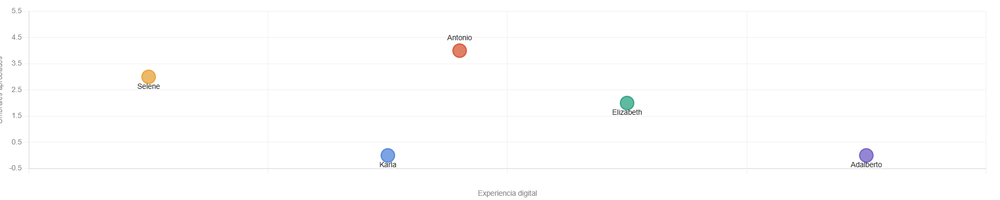
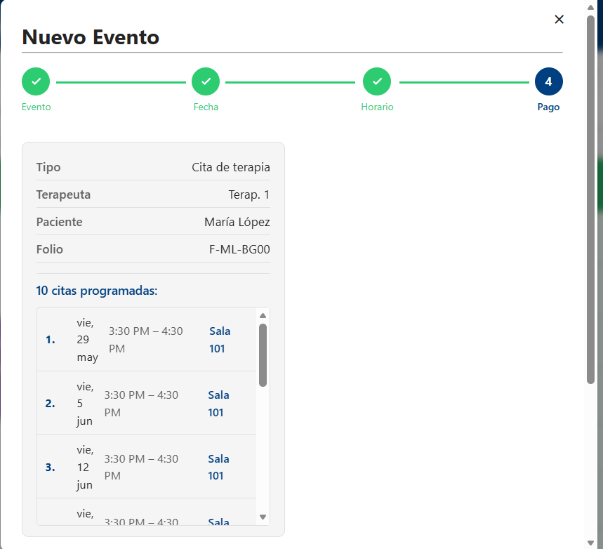

# Usability Testing — Agenda Module ClinicaWeb 

---

## 1. Test Details

### Technique
Sessions were conducted under the **think-aloud protocol**: participants were asked to verbalize their thought process as they interacted with the system, allowing evaluators (us), to identify confusion, hesitation, and decision points in real time. Audio from each session was recorded in full to support post-session metric estimation and qualitative analysis.

### Participant Selection

*Since we didn´t get to do the usability testing with the clinic members, the user personas were a little bit off from the real users. like expereince with clinic proccess, a little younger, and so on*

Participants were selected from the team members' family circles similar to **the user persona** (excluding age, experience with the clinic and knowledge of clinic systems) We chose administrative or semi-administrative backgrounds, ages between 53 and 62, and limited to no prior experience with specialized clinical management software.

| Participant | Age | Profile | Digital Experience |
|---|---|---|---|
| Karla Medina | 53 | Secretary / Administrative | Basic — Word and Excel |
| Adalberto Manzanilla | 62 | Department Head | High — 30+ years file and data management |
| Elizabeth Delgado Cuevas | 58 | Administrative User | Medium-High — prior experience with similar systems |
| Selene Romero | 56 | Homemaker | None — no prior experience with Word or Excel |
| Antonio Perez | 58 | Systems Engineer | Basic — Word and Excel |

#### Context and Task Briefing
*We had to give a lot of context of the system*
Before each session, the evaluators provided participants with a contextual explanation of the system: its purpose, the role they would play (**administrative staff managing clinical appointments**), and the goal of each task. Step-by-step instructions were not given during tasks.

Sessions lasted between 11 and 19 **minutes** each.

---

## 2. Materials Used

### Use Cases
Tasks were designed directly from the system's defined use cases ([use_cases.md](use_cases.md)). Each task covered one or more use cases:

| Task | Use Case |
|---|---|
| Create a therapy appointment | UC-AG-01 |
| Reschedule an existing appointment | UC-AG-02 |
| Cancel an appointment | UC-AG-03 |
| Process incoming requests from inbox | UC-AG-04 |
| Execute bulk rescheduling | UC-AG-05 |
| Filter the agenda view | UC-AG-06 |
| Review schedule workload and alerts | UC-AG-07 |

### Interface
The prototype evaluated was the Agenda Module web interface ([prototype/agenda/agenda.html](prototype/agenda/agenda.html)), which includes: a weekly calendar view with appointment creation wizard (4-step flow), incoming request inbox, audit log, filter bar, and bulk rescheduling module.

### Metrics and Usability Attributes
Evaluation was guided by the five metrics defined in [MetricsMeasurementTasks.md](MetricsMeasurementTasks.md), derived from the three usability attributes selected for the project ([attributes.md](attributes.md)): (Not because we already had the metrics and results, that never happend)

| Metric | Attribute | Threshold |
|---|---|---|
| M-01 — Avoidable error rate | Low error rate | ≤ 5% |
| M-02 — Error recovery time | Low error rate | Mean ≤ 30 s |
| M-03 — Completion without restart | Low error rate | ≥ 90% |
| M-04 — Perceived confidence before confirming | Satisfaction | ≥ 4.0 / 5 |
| M-05 — Autonomous error resolution | Learnability | ≥ 85% |

---

## 3. Evidence

Sessions were recorded as audio files. Each recording covers the participant's verbalization and the evaluator's facilitation from task start to session end. Metric values reported in this document are qualitative estimates derived from transcript analysis, applied against the protocol defined in MetricsMeasurementTasks.md.

**Usability Tests evidence (audio recordings):** [Google Drive folder](https://drive.google.com/drive/folders/1T5L61E-rVzr8L_b3Ilw5TV5gkWhFXjWy?usp=drive_link)

Individual session reports are available in the [usability_tests/users/](usability_tests/users/) directory, one file per participant.

---

## 4. Data Analysis

### 4.1 Metric Results by Participant

| Metric | Threshold | Karla | Adalberto | Elizabeth | Selene | Antonio | Pass Rate |
|---|---|---|---|---|---|---|---|
| M-01 Avoidable error rate | ≤ 5% | ~20% ❌ | ~15% ❌ | ~12% ❌ | ~10% ❌ | ~10% ❌ | **0 / 5** |
| M-02 Error recovery time | ≤ 30 s | ~45-60 s ❌ | ~40-50 s ❌ | ~18-25 s ✅ | ~30 s ✅ | ~20 s ✅ | **3 / 5** |
| M-03 Completion without restart | ≥ 90% | ~60% ❌ | ~70% ❌ | ~80% ❌ | ~90% ✅ | ~90% ✅ | **2 / 5** |
| M-04 Perceived confidence | ≥ 4.0 / 5 | ~2.5 ❌ | ~2.8 ❌ | ~4.2 ✅ | ~4.5 ✅ | ~4.5 ✅ | **3 / 5** |
| M-05 Autonomous error resolution | ≥ 85% | ~50% ❌ | ~55% ❌ | ~70% ❌ | ~80% ❌ | ~90% ✅ | **1 / 5** |
| **Thresholds met** | — | **0 / 5** | **0 / 5** | **2 / 5** | **3 / 5** | **4 / 5** | — |

### 4.2 Key Findings

**Finding 1 — M-01 failed universally (0 of 5 participants); M-03 and M-05 show partial recovery**

Every participant produced avoidable errors (M-01: 0/5 pass rate). Task completion without restart (M-03) and autonomous error resolution (M-05) showed partial improvement, with 2 and 1 participants passing respectively — driven by Antonio (4/5 metrics) and Selene (3/5 metrics). The system's preventive mechanisms exist technically but remain imperceptible to most users, particularly those without a technical background.

---

**Finding 2 — Filter discoverability failed in 4 of 5 sessions**

Filter controls (therapist, room, patient, type) were not independently located by Karla, Elizabeth, Selene, or Antonio. All four required evaluator intervention before the filter bar was found. Together with rescheduling confusion, this is the most widespread issue in the study — both affect 4 of 5 participants — and directly impacts M-01, M-02, and M-05.

---

**Finding 3 — Rescheduling flows are the highest source of failure (4 of 5 affected)**

Individual rescheduling caused a complete flow restart for Adalberto (accidental cancellation, all data lost). It required continuous guidance for Karla, and evaluator reorientation for Selene and Antonio (both entered incorrect dates, though each resolved it autonomously). Bulk rescheduling was entirely opaque to Adalberto, who could not determine whether operations were performed individually or in batch. A confirmed system bug was also detected: the original appointment remained active after rescheduling.

---

**Finding 4 — UC-AG-03 (appointment cancellation) is the only consistently smooth flow**

All three participants who performed the cancellation task completed it independently. This flow's visual design — a clear confirmation dialog with explicit "Cancel appointment" and "Keep appointment" buttons — is a functional reference pattern for other flows in the system.
 
---

**Finding 5 — Technical background and domain familiarity predict performance; raw digital literacy does not**

Antonio (Systems Engineer, basic digital literacy) was the strongest performer with 4 of 5 metrics met — surpassing Elizabeth (2/5) despite having less general digital experience. Adalberto (high literacy, different domain) and Karla (low literacy) both scored 0/5, confirming that raw digital fluency does not transfer. The pattern suggests that structured, analytical reasoning (from a technical background) and prior familiarity with analogous workflows are independent predictors of usability performance for this system.

 

---

### 4.3 Relation to Usability Attributes

| Attribute | Metrics | Result | Interpretation |
|---|---|---|---|
| **Low error rate** | M-01, M-02, M-03 | M-01: 0% pass rate. M-02: 60%. M-03: 40%. **Not passed** ❌ | Avoidable errors remain universal, but error recovery time and task completion improved for participants with structured backgrounds. Prevention mechanisms are present but imperceptible for most of the target profile. |
| **Satisfaction** | M-04 | 60% pass rate (3/5 participants). **Not passed** ❌ | Participants with structured or technical backgrounds felt confident before confirming. Less experienced users still struggled to build confidence — a partial failure of RNF-US-05, RNF-US-06, and RNF-US-07. |
| **Learnability** | M-05 | 20% pass rate (1/5 participants). **Not passed** ❌ | Only Antonio resolved errors autonomously at threshold. The system's recovery mechanisms exist but are not self-explanatory for the broader target population, though they are accessible to technically-oriented users. |

For the detailed data behind each finding, see the full consolidated report: [usability_tests/Usability_tests_report.md](usability_tests/Usability_tests_report.md)

---

## 5. Results

### Why the system failed

The Agenda Module in its current state meets usability thresholds only partially and inconsistently across the five participants tested. One of the main reasons is their unfamiliarity woth the clinic´s process and that is why they took on average 15 **minutes** to complete all of the scenarios and  Something that was kind off odd is that the Metric 1 failed drastically and Metric 4 (**satisfaction**) did very good, we guess since they are our parents , dind´t want to hurt our feeling. Like Nielsen said, 80% of usability problems are found in a group of 4-5 people, we could have pproved that.

### Behavior with Unfamiliar Users

Users without prior experience in similar systems generally required significant evaluator support. Karla (basic digital literacy) and Adalberto (high literacy, unrelated domain) needed continuous intervention across most tasks and both met zero thresholds. Selene (no digital experience whatsoever) required an unusually detailed session briefing before any task could begin and guidance on several individual tasks — yet her cautious, deliberate approach enabled three independent completions and zero failures, placing her above both Karla and Adalberto. The session briefing requirement itself reflects a design gap: a system targeted at heterogeneous administrative staff should not depend on extensive onboarding to reach basic usability.

Notably, Selene (no digital experience) and Antonio (Systems Engineer, basic digital literacy) both produced the fewest avoidable errors (M-01 ~10%) — Selene due to cautious, deliberate interaction, Antonio due to structured problem-solving. The contrast in their overall profiles (Selene: 3/5 metrics, Antonio: 4/5) illustrates that caution reduces errors but technical reasoning is additionally required to resolve them autonomously and complete flows without guidance.

### What Can Be Improved

The evidence points to three structural gaps that affect all three usability attributes simultaneously:

1. **Visibility of primary actions** — The Save/Confirm button was not found independently by two of five participants (Karla and Selene). The undo window was missed entirely in one session, because they had to scroll down and kinda missed the button

*Here the save button is not visible*

2. **Discoverability of secondary controls** — Filters, audit navigation, and calendar grid interaction are not intuitively accessible. Progressive disclosure, onboarding cues, or improved visual affordances are needed before these features can be considered functional for the target user.